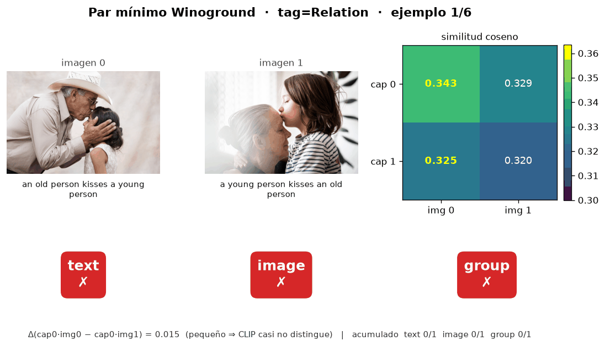
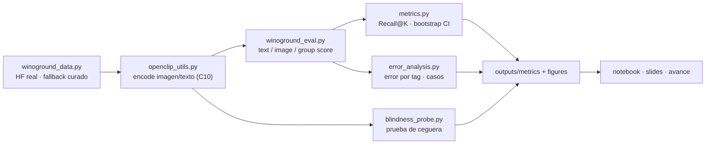

# Retrieval alto ≠ razonamiento composicional: evaluación de CLIP en Winoground

**Niels Victor Pacheco Barrios** · Maestría en Ciencias de la Computación · MCC225 (IA Generativa y Aprendizaje Multimodal) · 2026-1

> **Tesis.** Un *dual-encoder* tipo CLIP puede alcanzar **retrieval alto** (Recall@5 ≈ 0.67)
> y, aun así, **fallar el razonamiento composicional** de Winoground: su *group score*
> (0.075) queda **por debajo del azar** (1/6 ≈ 0.167) y muy lejos del humano (0.855).
> Tener buen retrieval **no** garantiza composición. Este repositorio lo demuestra con
> evidencia reproducible y explica la causa mecanística: la ausencia de *cross-attention*
> entre las dos torres del encoder.



*Demo (`make demo-visual`): en cada par mínimo, CLIP asigna similitudes casi idénticas a
ambos captions (Δ ≈ 0.01) y elige la misma imagen para los dos → falla el `group`.*

**🔗 Ver directo:** [📓 Cuaderno 14 resuelto (con resultados)](notebooks/Cuaderno14_MCC225_resuelto.ipynb)
· [🧭 Respuesta de la Actividad 5](reporte_evaluacion_responsable.md)
· [🖥️ Slides (PDF)](slides/latex/exposicion2_winoground.pdf)
· [📃 Avance técnico (PDF)](docs/avance_tecnico_MCC225.pdf)

---

## 1. Problema

Winoground evalúa **razonamiento composicional visio-lingüístico** con **pares mínimos**:
dos imágenes y dos captions que usan *las mismas palabras* reordenadas y difieren solo por
composición (p. ej. *"the old person kisses the young person"* vs. su inversión). Un modelo
resuelve un ejemplo solo si acierta simultáneamente:

- **text score:** dado cada imagen, elegir el caption correcto;
- **image score:** dado cada caption, elegir la imagen correcta;
- **group score:** ambos a la vez (la métrica que exige composición real).

Azar: text/image = 0.25, group = 1/6 ≈ 0.167. Humano ≈ 0.855.

**Pregunta.** ¿Un dual-encoder contrastivo (CLIP), fuerte en recuperación, entiende la
composición, o solo reconoce presencia de conceptos?

## 2. Método

**Arquitectura evaluada: dual-encoder CLIP** (`ViT-B-32/laion2b`). Dos torres transformer
independientes —una de imagen (ViT), una de texto— con **self-attention interna**; se
comparan solo al final por **similitud coseno**. No hay *cross-attention* entre modalidades:
esa es la hipótesis mecanística del fallo composicional.



**Protocolo de evaluación (contribución).** Además del *scorer* oficial —validado contra los
scores publicados de CLIP (`clip.jsonl`)— se añaden cinco análisis para separar *retrieval*
de *composición*: (i) Recall@K con IC *bootstrap*; (ii) error por *tag* (Object/Relation/Both);
(iii) **prueba de ceguera** (permutar imágenes para medir cuánto usa la visión); (iv) contraste
directo R@K vs group; (v) comparación de 3 checkpoints. El `Cuaderno14` reproduce este pipeline
sobre 120 pares reales adaptados al proyecto (retrieval, CLIPScore, captioning BLIP, ablaciones
de robustez y análisis de errores anotado); ver [ADR 0002](docs/adr/0002-cuaderno14-sobre-winoground.md).

## 3. Resultados

**Winoground oficial (400 pares, `ViT-B-32/laion2b`):**

| Métrica | Modelo | Azar | Humano |
|---|--:|--:|--:|
| text score | **0.347** | 0.25 | — |
| image score | **0.110** | 0.25 | — |
| **group score** | **0.075** | **0.167** | **0.855** |
| Recall@5 (t2i) | **0.667** | — | — |
| Recall@10 (t2i) | **0.774** | — | — |

El *scorer* reproduce exactamente los valores oficiales de CLIP (text=0.3075 / image=0.105 /
group=0.08) vía `python scripts/validate_against_official.py`.

**Lecturas clave:**
- **Retrieval alto, composición ≈ azar.** R@5=0.67 frente a group=0.075 (IC 95% *bootstrap*
  entero por debajo de 0.167): el modelo recupera bien pero no compone.
- **La relación es lo más difícil.** Por *tag*: Relation group=0.047 (n=233) < Object 0.085
  (n=141) < Both 0.269 (n=26).
- **Sí usa la imagen, pero débilmente.** Prueba de ceguera: al permutar las imágenes el group
  cae de 0.075 a 0.015.
- **No es cuestión de checkpoint.** ViT-B-32/laion2b (0.075), ViT-B-16/datacomp_xl (0.073),
  ViT-L-14/openai (0.085): todos cerca del azar.
- **Cuaderno14 (120 pares locales):** retrieval i2t R@5=0.87 (baseline de captions desplazados
  0.03) y **robustez** a degradación visual (CLIPScore 0.26–0.27 en blur/gris/recorte); los
  captions BLIP puntúan bajo (BLEU≈0.07) porque describen la escena pero pierden la composición.

Figuras en `outputs/figures/` (scores vs azar, R@K vs group, por tag, ceguera, checkpoints,
casos cualitativos). Tablas exactas en `outputs/tables/` y `outputs/metrics/`.

## 4. Análisis de errores

La hoja anotada (`outputs/tables/plantilla_analisis_errores.csv`, 29 casos) concentra los
fallos en **relación espacial** (12/29) y **binding de atributos/roles** (acción 4, atributo 3,
conteo 3): justo lo que un dual-encoder sin cross-attention no separa. En los pares mínimos, la
diferencia de similitud entre las dos imágenes para un mismo caption es ~0.01 → el modelo no
distingue *quién hace qué a quién*.

## 5. Evaluación responsable (Actividad 5)

`reporte_evaluacion_responsable.md` cierra con una evaluación de uso responsable: 5 casos reales
(2 aciertos, 2 errores, 1 ambiguo, trazables a `outputs/metrics/failure_cases.json`), pruebas de
confiabilidad (casi insensible a la negación, Δ≈−0.008) y una clasificación honesta:
**parcialmente confiable / solo en condiciones controladas**, uso recomendado **limitado**.
Afirmar que "CLIP entiende la relación espacial" sería irresponsable con esta evidencia.

## 6. Reproducibilidad

```bash
# entorno local (uv + Python 3.12)
make setup           # .venv + instala .[dev,notebook]
make models          # convierte CLIP/BLIP a safetensors local (CVE-2025-32434)
make avance          # 120 pares reales + ejecuta el Cuaderno14 + anota errores
make run figures     # pipeline Winoground -> outputs/
make test validate   # 16 tests + validación contra clip.jsonl oficial
make demo            # demo en vivo (terminal)
make demo-visual     # demo VISUAL: paneles con imágenes + heatmap + GIF
```

**Todo está dockerizado** (imagen CPU en `Dockerfile`, servicios en `docker-compose.yml`):

```bash
docker compose run --rm avance      # reproducción completa (modelos + Cuaderno14 + pipeline + figuras)
docker compose run --rm winoground  # solo el pipeline Winoground
docker compose run --rm demo        # genera el demo visual (paneles + GIF) en outputs/demo/
```

Los resultados se escriben en el volumen montado (`./:/workspace`), así que aparecen en el host.
Atajos: `make docker-avance`, `make docker-demo`.

Sin uv/pyproject: `pip install -r requirements.txt`. El *scorer* está validado; CI (GitHub
Actions) corre tests + *smoke run* en cada push y cada noche.

## 7. Conclusión y trabajo futuro

El dual-encoder alcanza su techo: recuperación fuerte y robusta, pero composición cercana al
azar. La vía de cierre es un **cross-encoder profundo** (BLIP-2 / cross-attention, C5), que
modela la interacción imagen–texto token a token; ya se probó un *re-ranker-lite* validado por
folds como paso intermedio. La conclusión central se sostiene con evidencia reproducible:
**tener buen retrieval no garantiza composición.**

Las líneas de trabajo hacia el trabajo final (cross-encoder profundo, escala estadística,
hard-negative training, interpretabilidad de la atención, ambigüedad del benchmark) están
priorizadas con esfuerzo estimado en [`docs/TRABAJO_FUTURO.md`](docs/TRABAJO_FUTURO.md).

---

## Estructura del repositorio

```
src/         scorer Winoground · métricas · motor OpenCLIP · datos · ceguera · env
scripts/     pipeline (00–03) · validate · manifest · convert-models · demo · demo_visual
notebooks/   Cuaderno14_MCC225_resuelto.ipynb (ejecutado) · Winoground_Eval_MCC225.ipynb
outputs/     metrics/ · tables/ · figures/ · demo/   (evidencia commiteada)
docs/        avance técnico · flujograma · plan · ADRs · defensa · DEMO · ENTREGA
slides/      latex/ (Beamer→PDF: exposición 2 + defensa) · pptx/
tests/       pytest del scorer y métricas
```

## Novedades respecto al Examen Parcial 1

El Examen Parcial estableció la tesis con la evaluación OpenCLIP en Winoground (scores
text/image/group, IC *bootstrap*, error por *tag*, prueba de ceguera, comparación de
checkpoints). La **Segunda Exposición profundiza y amplía** ese avance:

| Nuevo en la Exposición 2 | Detalle |
|---|---|
| **Cuaderno 14 resuelto y ejecutado** | pipeline multimodal completo sobre 120 pares reales: retrieval Recall@K, CLIPScore, captioning BLIP (BLEU/ROUGE), CapFilt, ablación visual, perturbación textual y análisis de errores anotado (29 casos) |
| **Actividad 5 (evaluación responsable)** | reporte de 8 partes: 5 casos reales, confiabilidad, explicabilidad, sesgo y uso responsable |
| **Bug corregido** | fuga de datos en la métrica de captions (BLEU/ROUGE=1.0 espurios) detectada y corregida — pensamiento crítico, no solo ejecutar código |
| **Adaptación al proyecto** | correr el Cuaderno14 sobre datos reales de Winoground ([ADR 0002](docs/adr/0002-cuaderno14-sobre-winoground.md)) |
| **Demos** | en terminal, visual (paneles + GIF) y **app HTML interactiva** (`make demo`, `demo-visual`, `demo-app`) |
| **Nuevos entregables** | 8 slides de Exposición 2, avance técnico 2–3 pp, flujograma, plan, ENTREGA, banco de defensa y trabajo futuro |
| **Reproducibilidad ampliada** | conversión a safetensors (fix CVE-2025-32434), `requirements.txt`, servicios Docker `avance`/`demo`, targets de Makefile |

El *"Δ pequeño ⇒ CLIP casi no distingue"* del demo es la diferencia de similitud coseno entre
la imagen correcta y la incorrecta para un mismo caption: **Δ ≈ 0.01–0.02** significa que CLIP
les asigna casi la misma similitud y no separa el par mínimo → falla la composición.

## Entregables de la Segunda Exposición Académica

Checklist completo y trazabilidad rúbrica→archivo en
[`docs/ENTREGA_EXPOSICION2.md`](docs/ENTREGA_EXPOSICION2.md). Guía del flujo en
[`docs/FLUJOGRAMA_MCC225.md`](docs/FLUJOGRAMA_MCC225.md) · plan en
[`docs/PLAN_EXPOSICION2_MCC225.md`](docs/PLAN_EXPOSICION2_MCC225.md) · demo en
[`docs/DEMO.md`](docs/DEMO.md) · banco de defensa en
[`docs/RESPUESTAS_EXPOSICION2.md`](docs/RESPUESTAS_EXPOSICION2.md) · trabajo futuro en
[`docs/TRABAJO_FUTURO.md`](docs/TRABAJO_FUTURO.md).

| Entregable | Ubicación |
|---|---|
| Presentación 8 slides (PDF) | `slides/latex/exposicion2_winoground.pdf` |
| Avance técnico 2–3 pp (PDF) | `docs/avance_tecnico_MCC225.pdf` |
| Cuaderno 14 resuelto + outputs | `notebooks/Cuaderno14_MCC225_resuelto.ipynb` · `outputs/` |
| Actividad 5 aplicada | `reporte_evaluacion_responsable.md` · `evaluacion_responsable_mcc225/` |
| Evidencia reproducible | `outputs/metrics/` · `outputs/tables/` · `outputs/figures/` |

### ¿Dónde está el Cuaderno 14?

| Archivo | Qué es |
|---|---|
| `notebooks/Cuaderno14_MCC225.ipynb` | Base sin resolver (traído del repo del curso) |
| `notebooks/Cuaderno14_MCC225_resuelto.ipynb` | **Resuelto y ejecutado** (24 celdas, 0 errores, 120 pares reales de Winoground) |
| `reports/reporte_exposicion_2.md` · `outputs/tables/` · `outputs/metrics/` | Reporte y evidencia que produce |

Reproducir: `make avance` (o `docker compose run --rm avance`).

### Cómo se resuelve la Actividad 5 (8 partes)

Se adapta el Cuaderno14 al proyecto (dual-encoder CLIP en Winoground; ver
[ADR 0002](docs/adr/0002-cuaderno14-sobre-winoground.md)) y se completan las 8 partes con
evidencia real y trazable — ningún caso inventado:

| Parte de la Actividad 5 | Cómo se resuelve | Evidencia |
|---|---|---|
| 1. Proyecto y tarea | Ficha: CLIP en Winoground, matching/retrieval composicional | `reporte_evaluacion_responsable.md` |
| 2. Adaptación del Cuaderno14 | 120 pares reales, CLIP ViT-B/32, baseline desplazado | `docs/adr/0002-…` |
| 3. Resultados cuantitativos | E1 retrieval · E2 ablación visual · E3 Winoground *group* | `results/metricas.csv` |
| 4. Cinco casos (2✓/2✗/1 ambiguo) | tomados de casos reales del experimento | `results/casos_analizados.csv` · `outputs/metrics/failure_cases.json` |
| 5. Confiabilidad | sensibilidad a la negación (Δ≈−0.008) + caso difícil | `outputs/tables/perturbacion_textual.csv` |
| 6. Explicabilidad | prueba de ceguera (0.075→0.015) + error por *tag* | `outputs/metrics/blindness.json` · `by_tag.csv` |
| 7. Sesgo y uso responsable | ficha; uso recomendado **limitado** | `results/ficha_uso_responsable.csv` |
| 8. Conclusión (450–600 pal.) | síntesis honesta: *parcialmente confiable* | `reporte_evaluacion_responsable.md` |

Figura de apoyo: `figures/ejemplos_evaluados.png` · índice: `evaluacion_responsable_mcc225/README.md`.

## Uso de herramientas generativas

Trabajo individual (MCC225). El código y la redacción se desarrollaron con asistencia de IA
generativa, declarada conforme a la consigna; **todos los valores numéricos** provienen de
archivos reproducibles del repositorio y las definiciones de métrica se verificaron contra el
paper de Winoground y el *scorer* oficial (`clip.jsonl`).
