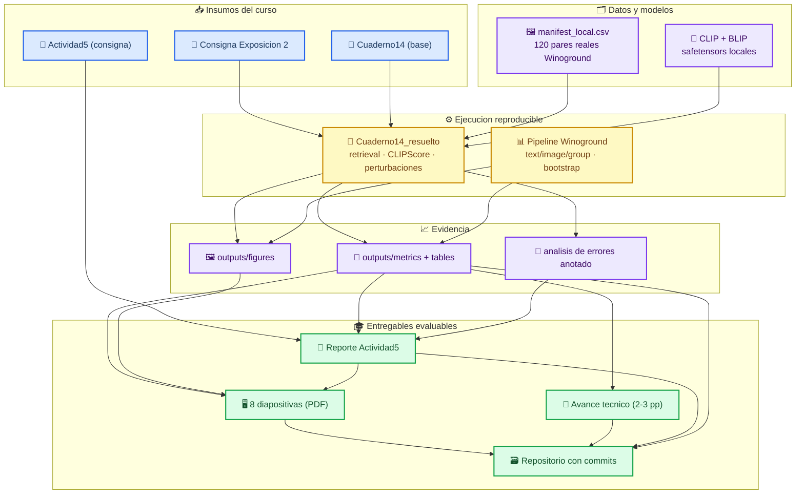
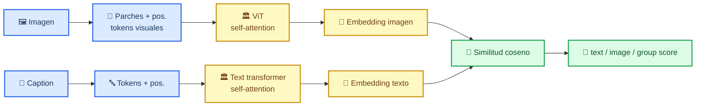
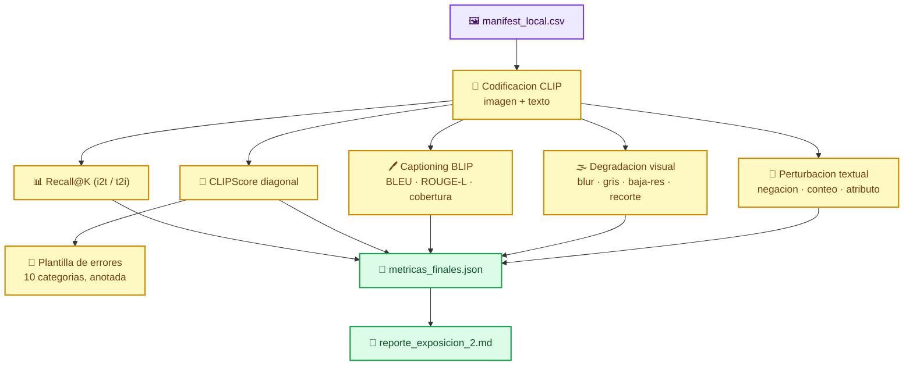
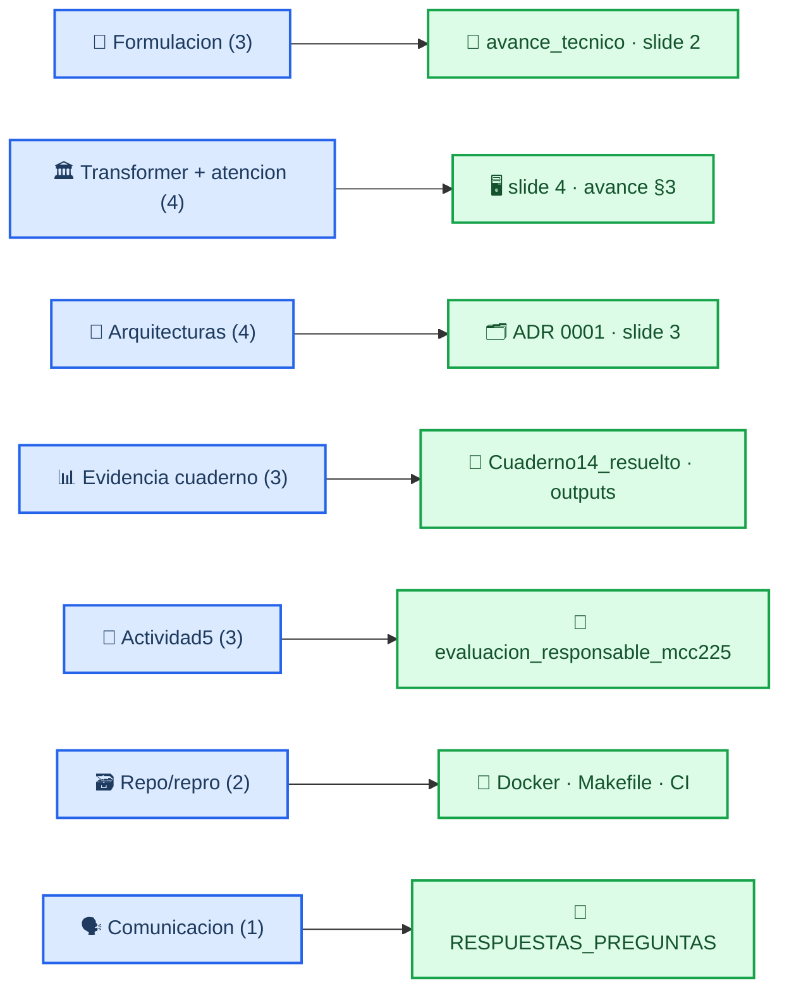

# Flujograma — Segunda Exposición Académica MCC225

Este documento traza, con diagramas Mermaid como fuente de verdad, el flujo completo
del avance integrador presentado para la **Segunda Exposición Académica** de
MCC225A (IA Generativa y Aprendizaje Multimodal). El proyecto integrador es la
evaluación de un **dual-encoder CLIP** sobre **Winoground**, extendida con el
`Cuaderno14` y la `Actividad5` (evaluación responsable).

Todos los números citados provienen de archivos reales del repositorio
(`outputs/metrics/`, `outputs/tables/`) y son reproducibles con `make avance`.

## 🔭 Flujo general del trabajo

_Flujograma de extremo a extremo: desde los insumos del curso hasta los entregables
evaluables, pasando por la ejecución del cuaderno y la evaluación responsable._

## 🧩 Arquitectura del modelo (dual-encoder CLIP)

_Diagrama de la arquitectura evaluada: dos torres transformer independientes (imagen
y texto) con self-attention interna, unidas solo al final por similitud coseno. La
ausencia de cross-attention entre torres es la razon mecanistica de la composicion
debil._

## ⚙️ Pipeline de evaluación del Cuaderno 14

_Secuencia de etapas del cuaderno resuelto: carga de datos reales, codificacion CLIP,
metricas de alineamiento, ablaciones de robustez y consolidacion de evidencia._

## 🗺️ Trazabilidad rúbrica → archivo

_Mapa de cada criterio de la rúbrica (20 pts) al artefacto del repositorio que lo
sustenta. Sirve como checklist de defensa._

## 🐳 Reproducción

Dos caminos equivalentes; ambos regeneran datos, modelos, evidencia y figuras.

| Camino | Comando |
|---|---|
| Entorno local (uv/venv) | `make setup && make models && make avance && make run && make figures && make test` |
| Docker | `docker compose run --rm avance` |

Documentos relacionados: [PLAN_EXPOSICION2_MCC225.md](PLAN_EXPOSICION2_MCC225.md) ·
[ENTREGA_EXPOSICION2.md](ENTREGA_EXPOSICION2.md) ·
[adr/0002-cuaderno14-sobre-winoground.md](adr/0002-cuaderno14-sobre-winoground.md) ·
[../Actividad5-MCC225.md](../Actividad5-MCC225.md)
